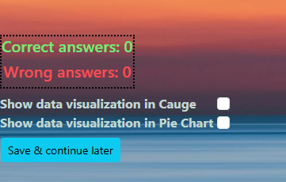
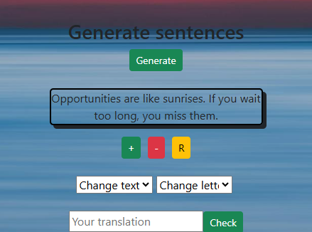
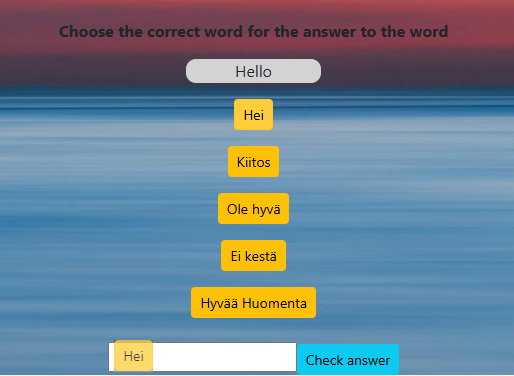

Project keywords: ReactJS, Node.js, MySQL, AI-integration, Axios, ExpressJS, LibreTranslate API

SPECIFICATIONS

The frontend is made with ReactJS and the backend with Node.JS. Artificial intelligence is implemented using Chat GPT 3.5 API. The application uses MySQL as a database and HTTP requests are implemented using the Axios library. Communication between the application and the GPT API is implemented using JavaScript's Fetch method.

MAIN FEATURES

The idea of ​​the application is to present the user with questions related to learning Finnish or Swedish, retrieved from the SQL database. The user selects the desired language from the html selection component. the selected language is saved with the onChange event handler in the State variable, which is passed as a query parameter to the Node.js backend. With the help of the parameter, the backend knows how to choose the right SQL table.

The questions are of the form "how do you say good day in Finnish? etc." The user writes his answer in the html input field of the question in the language asked in the question, after which the JavaScript function sends the question to the Chat GPT API.

Finally, the response given by the user is compared with the response given by the Chat GPT API.

Example image of the application's scoreboard, which is updated based on whether the user's answer is correct or incorrect. Data visualization options are shown in checkboxes, which by clicking the results are displayed in charts using Google Chart.

Example picture where the user has selected the Swedish language from the Select component and the first question retrieved from the SQL database is displayed.

ANSWERING A QUESTION BY SPEAKING

The user can also use the computer's microphone to answer questions. start using the microphone by clicking on the microphone icon. After clicking, a JavaScript function is executed that uses the SpeechRecognition library for speech recognition. Once the user's speech is recognized, it is converted to text and the text is added to the HTML input field. The microphone closes automatically with the onspeechend method.

TRANSLATION OF THE QUESTION INTO THE DESIRED LANGUAGE

The questions are presented in English by default. However, the user can translate the questions by choosing the language they want from the available options. Once the language is selected, an English question is sent to the LibreTranslate API using JavaScript's fetch method. as a response, the API returns the translated question and it is displayed in the HTML frontend. The program can also converts the translated question from text to speech using the Speech Synthesis API.

If desired, the user can also choose how many alternative translations are displayed in the selected language.
the amount is selected from the html component. the selected amount is stored in a state variable using the onChange event handler. Finally, the status variable is passed to the options property of the LibreTranslate API.

In this project, the LibreTranslate API runs locally and needs to be started using the command prompt. A button has been created in the program, which, when clicked, calls a Node.js method that starts LibreTranslate with the exec function. So the user does not have to use the command prompt separately, but the exec function of the Node.js method handles the startup. Closing the LibreTranslate API is also done with the exec function.

Example image where the user has translated the given question from English to German using the LibreTranslate API. 

LISTENING THE QUESTION

The user can also listen to the question asked. The question is converted from text to speech using
the JavaScript Web Speech API. The operation of the Web Speech API is implemented by a simple function
that is executed when the user clicks a button. 

The application locates the user's country based on the IP address using the Geoapify API. After localization, the user can optionally change the language of the localized country to the language of the SpeechSynthesis API.

The text-to-speech feature of this app can also repeat a translated question. For example, the program repeats a question translated into Spanish in Spanish, etc. This is done with a simple variable. When the user selects a language from the html selection component, the onChange event handler sends the language code of the selected language to the function that implements the speaking. The language "value" attribute of each Select component is the language code for that language, which is passed to the function when the user selects the language.

LISTEN TO THE ENGLISH SENTENCES AND WRITE THE ANSWER IN FINNISH

The program uses mp3 files with short sentences suitable for language learning. 
The user first listens to the sentence and writes the answer in the input field. the response of the input field is stored in a state variable and given as a parameter to the JS fetch method that communicates with the GPT API. The GPT-API checks the user's answer and if the answer is correct, the user can listen to a new sentence.

The user can adjust the audio speed of the mp3 file to be slower or faster with the push of a button.
This is done with the JavaScript playbackRate method. PlaybackRate defaults to 1.0 and is stored in the React State variable. Depending on the user's choice, the value of the playback rate is increased or decreased by 0.5 per click.

RANDOM SENTENCES

User can generate random phrases to display in the app. Random phrases are generated using the external Quote API and retrieved using the JavaScript Fetch method. The idea is that the user reads the sentence and translates it into Finnish by writing the answer in the html input field. the translated sentence is sent to the GPT API, which checks the correctness of the user's answer.

An example image with a random phrase fetched from the API and displayed to the user. The user can increase or decrease the font of the generated text by clicking the plus and minus buttons. Both buttons have a JavaScript function that uses the getComputedStyle and getPropertyValues ​​functions to increase and decrease the font size of the element's text. Each click decreases/enlarges the font by 2 pixels at a time.
The default font size is 16 pixels and the user can reset the size by clicking the R button.

The color of the text can also be changed by selecting one of the colors of the selected component. The Select component has an onChange event handler that sends the selected color as a parameter to a JavaScript function that implements the text color change. You can also change the letter spacing. It has its own html selection component that works in the same way as the text color change described above.

DRAG N DROP

The user can also use the drag and drop function when answering the questions. The drag and drop feature of this app is made without any external libraries. The drag and drop feature in this app uses the HTML 5 Drag N Drop API and JavaScript code.

Example picture where the user drags the answer button with the mouse into the input input field.
The question and answer options are obtained from an external json file, which are looped with the JS map function and displayed in the button elements.

CHANGING WEB SPEECH API VALUES ​​AND SETTINGS

The user can change the voice, speed, pitch and volume of the Speech API. The change settings are displayed in the React Carousel component, where the user can select one or more settings that they want to change.
the changed settings are visible to the user in the html-p-tag, from where they are also passed to the JavaScript function that implements the speech synthesis.

DATA VISUALIZATION

The application stores the incorrect and correct answers in two state variables. The user can choose whether he wants to see the results in text or visually. The visualization is done with Google charts and the right and wrong answers are shown in a Cauge chart or a pie chart depending on the user's choice.

The user makes a selection by clicking on a checkbox, both checkboxes have their own value property, the value of one property is "Gauge" and the value of the other is "PieChart". 

After selecting the checkbox, the value of the "value" property is sent using the onChange event handler to a function that displays the Google Chart component and gives the value of the selected checkbox to the chartType property of the Chart component.

SAVE & CONTINUE LATER

This feature will save the ID number of the current question in localStorage if the user clicks the Save and Continue button. The idea is that the user can later continue studying the same question and does not have to start from the beginning.

ASKING A TIP

The user can request a hint about the correct answer by clicking the "Ask hint" button. With each press, one letter of the correct answer is retrieved from the SQL database and the letters are displayed in the html input field. This feature uses a state variable to track the number of clicks and the displayed letter

AUXILIARY IMAGES

In connection with each phrase asked, an auxiliary image is also shown that describes the word/sentence in question. The application uses images from Openclipart.org and the url addresses of the images are stored in the database used by the application. When each question is displayed, the url address of the image is also retrieved from the database, the address is used in the src property of the img element, so that the image itself is displayed.

When loading auxiliary images, a CSS animation is always implemented, which rotates the image 360 ​​degrees.
This feature is made with CSS-animate and Transform methods. Reloading CSS animations is done with two identical CSS classes, which are given alternately as the class name of the div containing the img element.

ADJUSTMENT OF AUXILIARY IMAGES

The user can adjust the brightness, hue-rotate and contrast of the auxiliary images with the html slider. The default brightness and contrast is 100% and can be adjusted between 1-200%. The brightness/contrast values are stored in the State variable and the variable is sent to the style property of the auxiliary img element. These properties use the CSS brightness and CSS contrast functions.

The default size of auxiliary images is 200 x 200 pixels. The user can zoom in or out auxiliary image by using clicking the buttons. each click resizes the guide image by 5 pixels in height and width. Image size values ​​are stored in state variables, and increment/decrement functions change these variable values.
You can also reset the auxiliary image to its default size at any time by clicking the reset button.

COMMON WORDS

The application uses a JSON file in which common words and sayings are stored in Finnish, Swedish and English.
Depending on the user's choice, word pairs are retrieved and displayed from the JSON file either in Finnish and English or in Finnish and Swedish. The purpose of this feature is to help a user who does not know Finnish or Swedish, but knows English.

The user can also listen to the pronunciation of the word by clicking the button below the word. This feature is implemented using the Web Speech API.

Example image where words in Finnish and English have been retrieved from the JSON file. The words appear inside the html border element.

